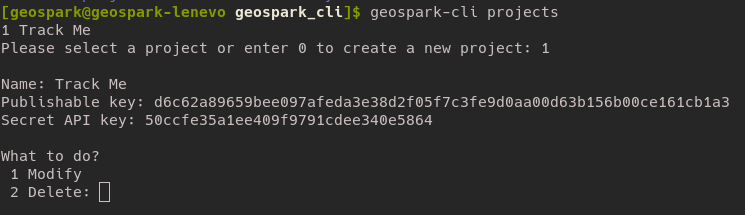

# geospark-cli

GeoSpark CLI (command line interface) provides login via command line and perform CRUD operation for projects and apps.

# Basic Setup

Install the all the requirements using below command.

```
$ pip install --editable .
```

After this setup you are ready to use the geospark-cli.

# Loign with Geospark Account

```
$ geospark-cli login
```


# CRUD for Project and App

```
$ geospark-cli projects
```

This command gives all the created projects and provides all the instructions for creation, deletion etc,. for a project.


* To retrive the project's information provide the respective number of the project.
* Once selected *Project Name, Publishable key and Secret API key* appear on the shell.
* Follow the instructions for deleting and modifying the project.




